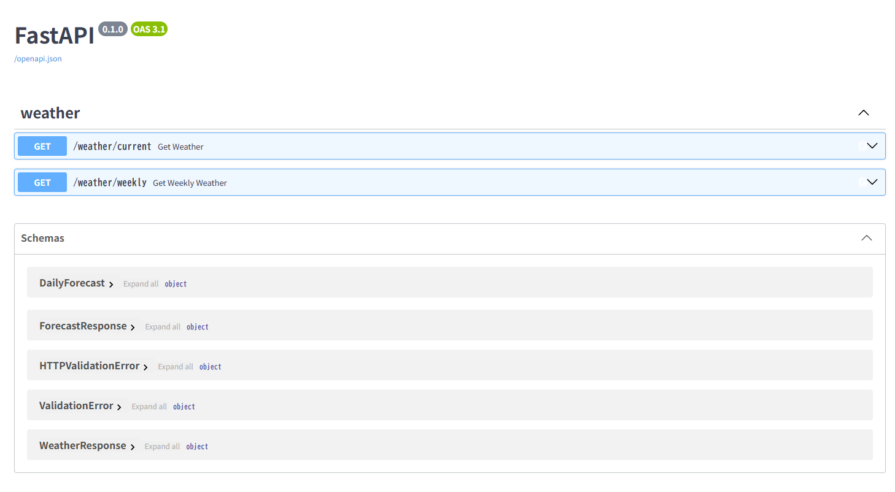
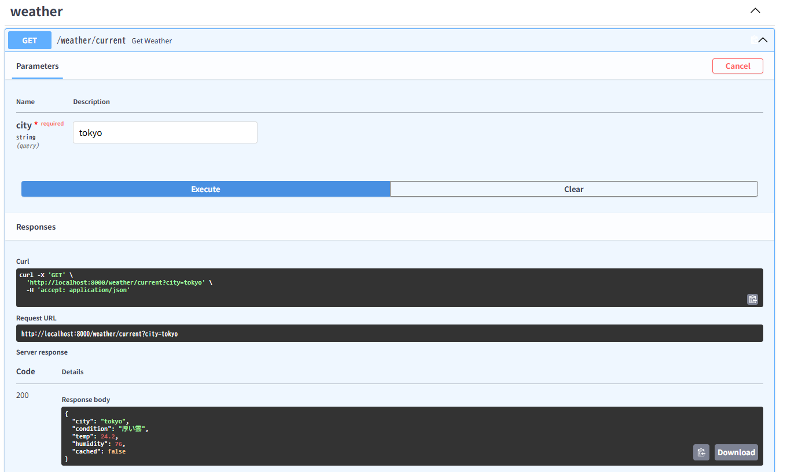
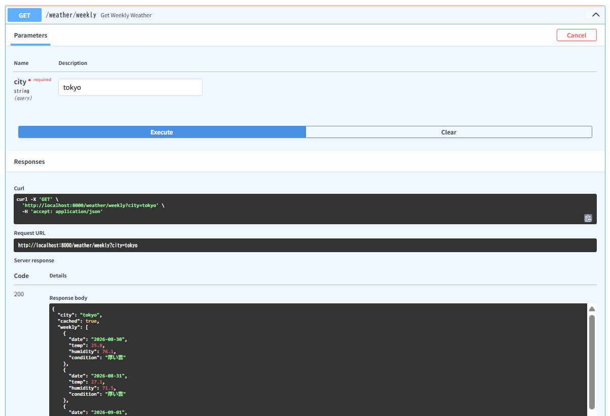
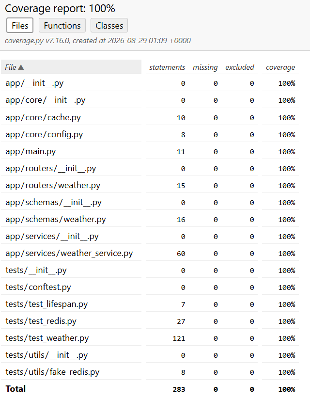

# weather API (FastAPI + Redis + httpx)

## プロジェクト概要
FastAPI + 非同期処理 + Redisキャッシュ + 外部API連携の天気情報APIです。
外部 API（OpenWeatherMap）を httpx で非同期アクセスし、Redis にキャッシュすることで高速化しています。  
pytest + respx による 完全モックテスト、coverage による 100% テストカバレッジ を達成しています。

## Swagger UI


## 現在の天気


## 週間天気予報


## 特徴
- FastAPI による軽量な Web API
- OpenWeatherMap API を httpx で非同期アクセス
- Redis によるキャッシュ（10分）
- 現在の天気（天気・気温・湿度）
- 週間天気予報 (5日分)
    └─ 3時間ごとのデータを日ごとに集計
- pytest + respx による外部 API モック
- coverage による 100% テストカバレッジ
- ASGITransport による FastAPI の高速テスト

## ディレクトリ構成
```
app/
├── main.py
├── core/
│   ├── cache.py
│   └── config.py
├── services/
│   └── weather_service.py
├── schemas/
│   └── weather.py
└── routers/
    └── weather.py

tests/
├── test_weather.py
├── test_lifespan.py
└── utils/
    └── fake_redis.py
```

## 使用技術

- Python 3.11+
- FastAPI
- httpx
- redis-py
- pytest
- respx
- coverage
- uvicorn

## 環境変数
OpenWeatherMap の API キーを `.env` に設定します。
```
WEATHER_API_KEY=あなたのAPIキー
WEATHER_API_BASE_URL=https://api.openweathermap.org/data/2.5/weather
WEATHER_FORECAST_URL=https://api.openweathermap.org/data/2.5/forecast
```

## API エンドポイント
### 現在の天気
GET /weather/current?city=Tokyo

**Response**

```json
{
  "city": "Tokyo",
  "condition": "厚い雲",
  "temp": 20.5,
  "humidity": 60,
  "cached": false
}
```

### 週間天気予報
GET /weather/weekly?city=Tokyo

**Response**

```json
{
  "city": "Tokyo",
  "cached": false,
  "weekly": [
    {
      "date": "2024-01-01",
      "condition": "厚い雲",
      "temp": 11.0,
      "humidity": 52.5
    },
    ...
  ]
}
```

## テストについて
### 全テスト実行
poetry run pytest -v

### coverage計測
poetry run coverage run -m pytest -v
poetry run coverage report

### HTMLレポート生成
poetry run coverage html
htmlcov/index.html をブラウザで開くと詳細が確認できます。

## テスト手法
- respx  
OpenWeatherMap API を完全モックして、外部通信なしでテスト可能。
- ASGITransport  
FastAPI アプリを直接叩く高速テスト。
- FakeRedis  
Redis を完全モックしてキャッシュの挙動を再現。
- 例外系テストを完全網羅
    - API が 500
    - httpx.RequestError
    - JSON 壊れ
    - キャッシュあり / なし
    - lifespan（起動時 / 終了時処理）

## Coverage
このプロジェクトは coverage 100% を達成しています。


## Docker
以下のコマンドでDockerを起動します。
```
docker-compose up -d
```